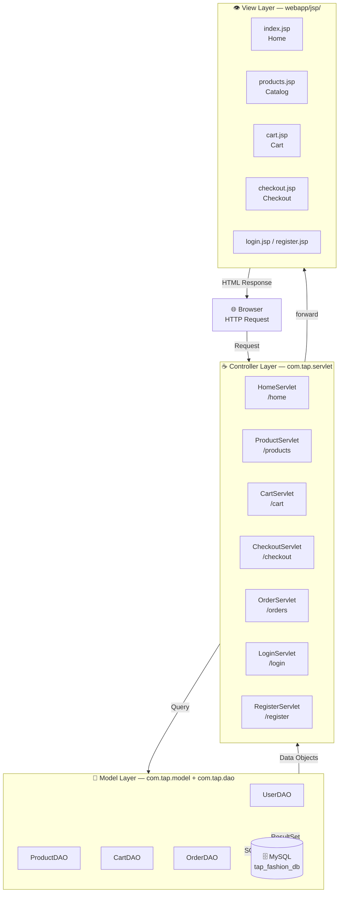
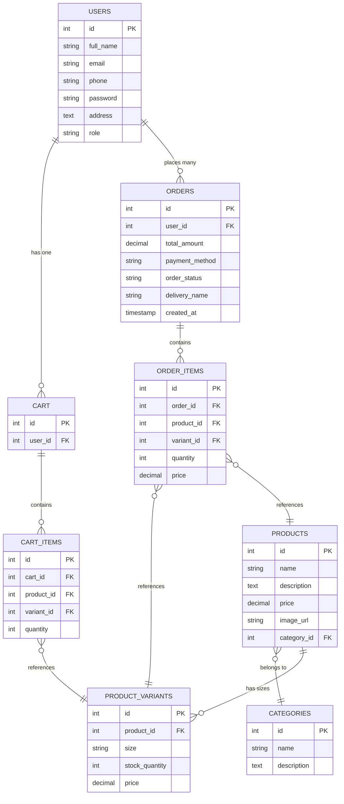

<div align="center">

# 🛍️ Fashion Vault

### *A Premium Full-Stack E-Commerce Web Application*

<br/>


<br/>

> **Fashion Vault** is a complete end-to-end fashion e-commerce platform built with  
> **Core Java · Servlets · JSP · MySQL · Maven** — no external frameworks, pure Java EE.

<br/>

[](http://localhost:8085)
[](./Presentation/project_documentation.html)
[](LICENSE)

</div>

---

## ✨ Features

<div align="center">

| Feature | Description |
|:---|:---|
| 🔐 **Authentication** | Register, Login, Logout with session management |
| 🛒 **Smart Cart** | Guest cart (session) merges into DB cart on login |
| 🔍 **Product Search** | Search by keyword across all categories |
| 📦 **Product Variants** | Size-based variants (S/M/L/XL, age groups for Kids) |
| 💳 **Checkout** | Full delivery form with COD & Credit Card support |
| 📋 **Order History** | View all past orders with item-level details |
| 👤 **Profile** | Edit name, phone, and delivery address |
| 🧭 **Smart Navbar** | Login ↔ Sign Up button swaps based on current page |

</div>

---

## 🗂️ Product Catalog

```
📦 Fashion Vault Catalog (33 Products)
├── 👔 Men's Apparel (8 items)
│   ├── Classic Crewneck T-Shirt          ₹599
│   ├── Graphic Casual T-Shirt            ₹699
│   ├── Premium White Formal Shirt        ₹1599
│   ├── Vintage Plaid Casual Shirt        ₹1399
│   ├── Classic Charcoal Formal Trousers  ₹1499
│   ├── Classic Indigo Jeans              ₹1699
│   └── Comfort Fit Casual Chinos         ₹1299
│
├── 👗 Women's Apparel (8 items)
│   ├── Elegant Formal Dress Combo        ₹2999
│   ├── Silk Formal Blouse                ₹2799
│   ├── V-Neck Casual T-Shirt             ₹699
│   ├── Oversized Linen Casual Shirt      ₹1499
│   ├── High-Waist Formal Trousers        ₹1899
│   ├── Classic Skinny Jeans              ₹1599
│   └── Relaxed Fit Casual Pants          ₹1299
│
├── 💍 Accessories (7 items)
│   ├── Men's Chronograph Leather Watch   ₹3499
│   ├── Women's Rose Gold Mesh Watch      ₹3299
│   ├── Silver Pendant Necklace Combo     ₹1499
│   ├── Men's Titanium Stud Earpieces     ₹499
│   ├── Women's Pearl Hoop Earpieces      ₹599
│   ├── Leather Crossbody Bag             ₹2499
│   └── Classic Aviator Sunglasses        ₹699
│
└── 🧸 Kids' Section (8 items)
    ├── Soft Cuddly Princess Doll         ₹799
    ├── Die-Cast Toy Race Car             ₹499
    ├── 100-Piece Animal Kingdom Puzzle   ₹399
    ├── Classic Ludo Board Game Set       ₹599
    ├── Educational Building Blocks Set   ₹999
    ├── Cotton Floral Summer Dress        ₹899
    ├── Denim Dungaree Combo              ₹1199
    └── Cozy Dino Hoodie & Joggers        ₹1299
```

---

## 🏗️ Architecture — MVC Pattern



---

## 🗄️ Database Schema



---

## 📁 Project Structure

```
fashion-vault/
│
├── 📄 pom.xml                          ← Maven build config & dependencies
├── 📄 readme.md                        ← You are here!
├── 📁 Presentation/
│   └── 📄 project_documentation.html  ← Full tech documentation
│
└── 📁 src/main/
    ├── 📁 java/com/tap/
    │   ├── 📁 connection/
    │   │   └── ☕ DBConnection.java     ← JDBC connection factory
    │   ├── 📁 model/                   ← Plain Java data objects (POJOs)
    │   │   ├── ☕ User.java
    │   │   ├── ☕ Product.java
    │   │   ├── ☕ Category.java
    │   │   ├── ☕ CartItem.java
    │   │   ├── ☕ Order.java
    │   │   ├── ☕ OrderItem.java
    │   │   └── ☕ ProductVariant.java
    │   ├── 📁 dao/                     ← Database access (all SQL here)
    │   │   ├── ☕ UserDAO.java
    │   │   ├── ☕ ProductDAO.java
    │   │   ├── ☕ CartDAO.java
    │   │   └── ☕ OrderDAO.java
    │   └── 📁 servlet/                 ← HTTP Controllers
    │       ├── ☕ HomeServlet.java
    │       ├── ☕ ProductServlet.java
    │       ├── ☕ ProductDetailServlet.java
    │       ├── ☕ CartServlet.java
    │       ├── ☕ CheckoutServlet.java
    │       ├── ☕ OrderServlet.java
    │       ├── ☕ LoginServlet.java
    │       ├── ☕ RegisterServlet.java
    │       └── ☕ ProfileServlet.java
    ├── 📁 resources/
    │   └── 📄 schema.sql               ← DB schema + 33 product seed data
    └── 📁 webapp/
        ├── 📁 css/
        │   └── 🎨 style.css            ← Dark theme design system
        ├── 📁 images/                  ← All product images
        └── 📁 jsp/                     ← HTML view templates
            ├── 📄 navbar.jsp
            ├── 📄 footer.jsp
            ├── 📄 index.jsp            (Home)
            ├── 📄 products.jsp         (Catalog)
            ├── 📄 product-details.jsp
            ├── 📄 cart.jsp
            ├── 📄 checkout.jsp
            ├── 📄 order-success.jsp
            ├── 📄 my-orders.jsp
            ├── 📄 order-details.jsp
            ├── 📄 login.jsp
            ├── 📄 register.jsp
            └── 📄 profile.jsp
```

---

## 🚀 Getting Started

### Prerequisites

Make sure you have the following installed:

| Tool | Version | Download |
|:---|:---|:---|
| ☕ Java JDK | 8 or higher | [adoptium.net](https://adoptium.net) |
| 📦 Apache Maven | 3.6+ | [maven.apache.org](https://maven.apache.org) |
| 🗄️ MySQL | 8.0 | [mysql.com](https://dev.mysql.com/downloads/) |

---

### ⚙️ Step 1 — Clone the Repository

```bash
git clone https://github.com/IKnowU27735300/tap-academy-fashion-vault.git
cd tap-academy-fashion-vault
```

---

### 🗄️ Step 2 — Set Up the Database

Open MySQL Workbench or your MySQL CLI and run:

```bash
mysql -u root -p < src/main/resources/schema.sql
```

This will automatically:
- ✅ Create database `tap_fashion_db`
- ✅ Create all 8 tables
- ✅ Insert 4 categories
- ✅ Insert all 33 products with size variants

> 💡 **DB Config** is in `src/main/java/com/tap/connection/DBConnection.java`  
> Default: `localhost:3307`, user: `root`, no password — edit if needed.

---

### ▶️ Step 3 — Run the App

```bash
mvn jetty:run
```

Then open your browser and visit:

```
http://localhost:8085
```

> 🔁 Jetty auto-reloads changes every **3 seconds** — no restart needed during development!

---

### 📦 Step 4 — Build a Deployable WAR (Optional)

```bash
mvn clean package
```

The WAR file is created at `target/fashion-store.war`.  
Deploy it to **Apache Tomcat** by copying it to `webapps/` folder.

---

## 🔧 Tech Stack — In Depth

| Technology | Version | Role | Why Chosen |
|:---|:---:|:---|:---|
| **Java SE** | 8 | Core language | Stable, widely taught, full Java EE support |
| **Java Servlets** | 3.1 | Controller (MVC) | Intercepts HTTP requests, runs business logic |
| **JSP** | 2.3 | View (MVC) | Server-side HTML templating with Java |
| **JSTL** | 1.2 | View helpers | Clean `<c:forEach>` tags, no raw scriptlets |
| **MySQL** | 8.0 | Persistent storage | ACID-compliant relational DB, free & powerful |
| **JDBC** | Built-in | DB communication | Raw SQL with `PreparedStatement` (no ORM) |
| **Maven** | 3.8 | Build tool | Dependency management, WAR packaging |
| **Jetty** | 9.4 | Dev web server | Lightweight, starts in seconds via `mvn jetty:run` |
| **Vanilla CSS** | — | Styling | Full control, no framework overhead |

> ❓ **Why no Spring or Hibernate?**  
> This project deliberately uses raw APIs to teach the **foundations**. Understanding Servlets & JDBC makes Spring intuitive instead of magical.

---

## 🔄 Request Flow

```
User clicks "Add to Cart"
        │
        ▼
🌐 Browser  ──POST /cart──►  ☕ CartServlet.doPost()
                                      │
                              reads HttpSession
                              (who is logged in?)
                                      │
                              calls CartDAO.addItem()
                                      │
                              SQL: INSERT INTO cart_items
                                      │
                              updates session cartCount
                                      │
                              forward ──► 📄 cart.jsp
                                      │
        ◄──────── HTML Response ──────┘
```

---

## 🌐 URL Routes

| URL | Servlet | Method | Description |
|:---|:---|:---:|:---|
| `/home` | HomeServlet | GET | Home page with featured products |
| `/products` | ProductServlet | GET | Product listing (filter/search) |
| `/product?id=X` | ProductDetailServlet | GET | Single product with variants |
| `/cart` | CartServlet | GET/POST | View cart / Add-Update-Remove items |
| `/checkout` | CheckoutServlet | GET/POST | Delivery form / Place order |
| `/orders` | OrderServlet | GET | Order history |
| `/orders?id=X` | OrderServlet | GET | Order detail view |
| `/login` | LoginServlet | GET/POST | Login form / Authenticate |
| `/login?action=logout` | LoginServlet | GET | Logout + invalidate session |
| `/register` | RegisterServlet | GET/POST | Register form / Create account |
| `/profile` | ProfileServlet | GET/POST | View / Edit profile |

---

## 💡 Key Design Decisions

> **Guest Cart Merging** — Users can add items to cart without logging in. Items are stored in the `HttpSession`. On login, the guest cart is automatically merged into the database cart.

> **Price Locking** — `order_items.price` stores the price at the time of purchase. Future product price changes never affect historical orders.

> **SQL Injection Prevention** — Every query uses `PreparedStatement` with parameterized values — never string concatenation.

> **Smart Navbar** — The navbar reads the `activePage` request attribute to contextually swap the **Login** button to **Sign Up** when the user is already on the login page (and vice versa).

---

## 📊 Stats

<div align="center">

| Metric | Count |
|:---|:---:|
| 📦 Total Products | **33** |
| 🗂️ Categories | **4** |
| 🗄️ Database Tables | **8** |
| ☕ Java Classes | **20** |
| 📄 JSP Pages | **13** |
| 🌐 URL Routes | **11** |
| 🖼️ Product Images | **30+** |

</div>

---

## 🧑‍💻 Author

<div align="center">

**Anish Inamadar**  
TAP Academy — Full Stack Java Developer Program  

[](https://github.com/IKnowU27735300)

</div>

---

## 📄 License

This project is open source and available under the [MIT License](LICENSE).

---

<div align="center">

*Made with ❤️ at TAP Academy · Fashion Vault v1.0*

⭐ **Star this repo if you found it helpful!** ⭐

</div>
